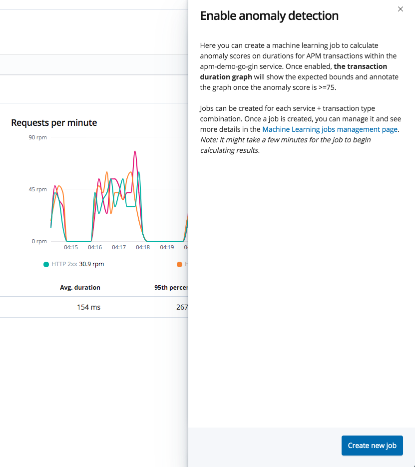

# Elastic APM Demo (by golang gin)

### How To Run

#### start service
```bash
# Download
git pull
# start
docker-compose up -d
```
#### load kibana objects

* Open in browser: [http://0.0.0.0:5601/app/kibana#/home/tutorial/apm?_g=(refreshInterval:(pause:!t,value:0),time:(from:now-15m,mode:quick,to:now))&_a=](http://0.0.0.0:5601/app/kibana#/home/tutorial/apm?_g=(refreshInterval:(pause:!t,value:0),time:(from:now-15m,mode:quick,to:now))&_a=)

* Click "Load Kibana objects"
#### Launch APM 
Click "Launch APM" Or open [http://0.0.0.0:5601/app/apm](http://0.0.0.0:5601/app/apm)


### APM
#### Services/Homepage
展示了各个接入的客户端(在服务启动时配置的ServerName)


#### transactions
在ElasticAPM data model中专指有APM AGENT 捕获到的事件.

* 主页

* 配置错误报告(email/slack)


#### trace
* 通过机器学习来查找不正常请求

* 请求时间线(用以查找性能瓶颈)

* 配置用户信息

* 配置自动标签


#### errors
* 主页

* 错误堆栈(自动隐藏库错误)


#### search
* 强大filter能力(带补全)


#### Discover
* 可以使用传动的Discover来进行图标制作


